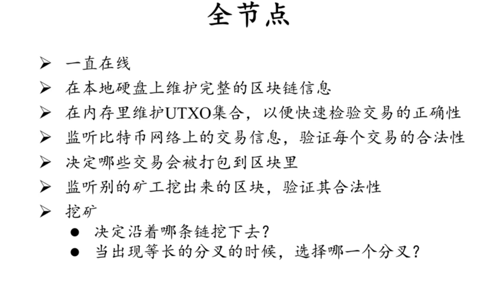
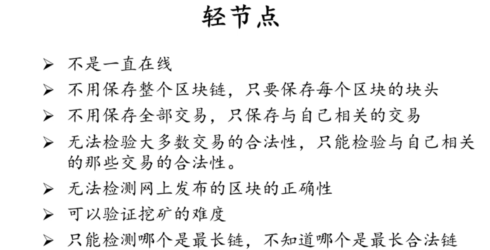
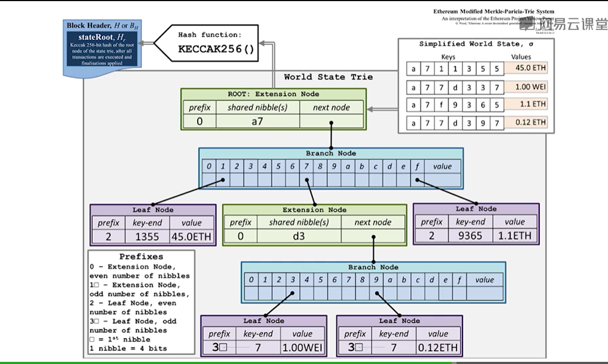
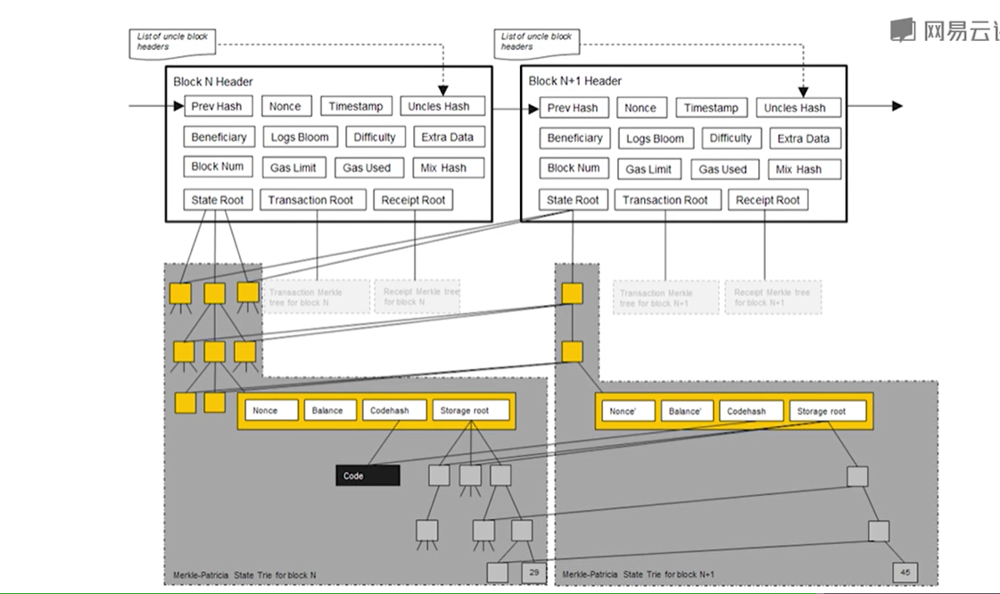
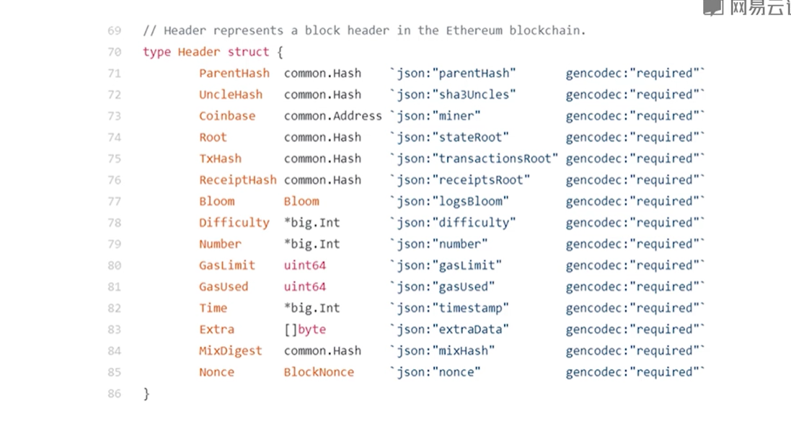

# 区块链技术与应用

## 比特币

- double spending attack
- 防止输入声明的哈希被伪造，输入中的哈希与来源中的哈希相等
- block header：version；hash of previous block header； merkle root hash，taget， noce
- 轻节点可以根据全节点发送的merkle proof来判断一笔交易是否合法
- UTXO：每笔交易必须说明输入的来源
- sybil attack 女巫攻击
- forking attack
- UTXO:Unspent Transaction Output 未花费交易输出
- transaction-based Ledger；account-based ledger
- 随机数nonce与coinbase的调整
- progress free, mamaryless
- geometric series
- confirmation，六个确认,zero confirmation
- selfish mining
- appliation layer: bitcoin block chain
- network layer: p2p overlay network
- simple, robust, but not efficient
- 等待上链集合
- best effort
- H(block header) <= target 难度与target成反比;2016个块调整一次，每次调整范围不超过4倍
- 难度越低，出块时间越短，越容易分叉，总算力被分散，更容易被攻击
- nBits,4位；恶意节点调整的不会被诚实节点认可
- 全节点

- 轻节点

- memoryless挖矿无记忆性
- 矿池中的POW：sahre，almost valid block
- fork：分叉
  - hard fork,硬分叉，block size limit，协议升级,没有升级的节点不认同升级后的协议
  - soft fork,软分叉，比如区块大小收到限制变小，没有升级后的节点仍然认可该协议,P2SH:pay to script hash，赎回脚本的哈希
- 判断交易的合法性：当前交易的输入脚本与输出脚本联合执行
- OPT_RETURN
- 同态隐藏
- 盲签方法
- 零币和零钞
- 多重签名

## 以太坊

- smart contract
- 比特币必须每次将上一笔全部花出去,没有基于账户的账本,基于交易的账户
- accout-based ledger
- double spending attack, replay attack(重放攻击)
- nonce 交易次数,发起交易后加入交易次数，签名
- 外部账户
  - balanec
  - nonce
- 合约账户
  - 不能发起交易
  - code
  - storage

### 账户

- addr -> state
- 160 bits 20位 一般表示为40个16进制数
- 哈希表, merkle tree：证明账户的余额，如果以账户及余额构造merkle tree会被新的区块影响,且太多,账户数量与交易数不在一个数量级
- trie 
  - ge, gene, genens,...
  - 不会出现碰撞,输入顺序不影响最终树的样子,更新局部性好
  - 不必要的存储和查找
- patricia tree
  - en 压缩
  - 路径压缩
- MPT Merkle Patricia tree
  - Modified MPT 以太坊,一个大的MPT包含很多小的MPT

- roll back
  - 分叉的回滚，智能合约的支持，导致简单的回滚几乎不可能，所以要保持历史状态方便回滚

- 账户(key, value)中value的存储
  - 序列化RLP(Recursive Length Prefix)
  - netsted array of bytes
