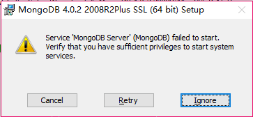

# MongoDB


## 安装

### Windows

#### 安装错误


1. 安装过程中出现service MongoDB failed to start，verify that you have sufficient privileges to start...
   1. 直接点Ignore,然后进入MongoDB目录下，进入data，新建一个文件夹，命名为db
   2. 进入MongoDB的bin目录，运行cmd，运行命令`mongod.exe --dbpath d:\tools\MongoDB\Server\4.2\data\db`,dbpath后的目录为刚新建的db目录
   3. 重新开启一个cmd，进入MongoDB的bin目录，输入mongo就能连接上
   4. 将bin目录配置到环境变量中，在任意cmd都可输入mongo连接MongoDB

#### 配置服务

配置服务后可以在命令行使用`net start MongoDB`启动，停止，重启等操作,在出现上图安装错误的情况下根据以下步骤配置服务

1. 以管理员运行cmd，先卸载MongoDB服务,`sc delete MongoDB`
2. 进入MongoDB的bin目录,修改mongod.cfg
```cfg
systemLog:
    destination: file
    path: D:\tools\MongoDB\Server\4.2\log\mongod.log
storage:
    # 这里修改为数据文件存储目录
    D:\tools\MongoDB\Server\4.2\data\db
```
3. 进入MongoDB的bin目录，管理员打开cmd，运行`mongod.exe --config "D:\tools\MongoDB\Server\4.2\bin\mongod.cfg" --install`安装MongoDB服务, 双引号中的为mongod.cfg位置