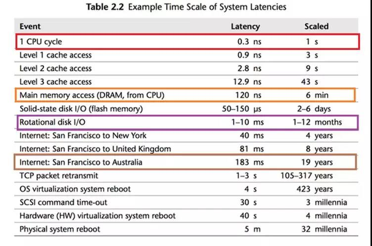
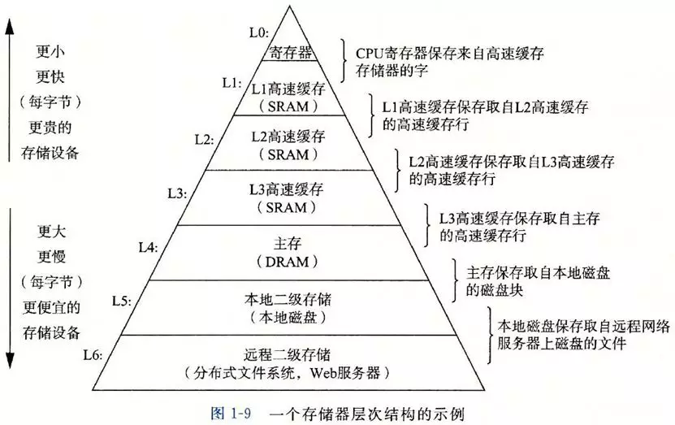
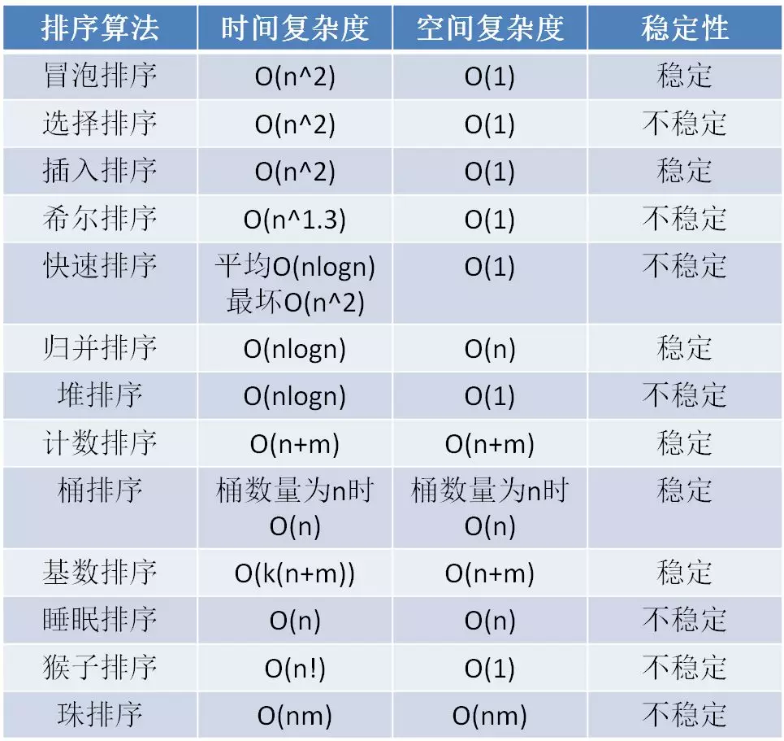

# 读书笔记

主要关于计算机基础与算法

- [读书笔记](#读书笔记)
  - [计算机各部位速度](#计算机各部位速度)
  - [存储器的层次结构](#存储器的层次结构)
  - [排序算法总结](#排序算法总结)

## 计算机各部位速度

很多计算机编程问题都是由于计算机各部分速度不一致导致的，如并发，缓存等等。

## 存储器的层次结构

## 排序算法总结

根据时间复杂度分为3个梯队，[总结自](https://mp.weixin.qq.com/s?__biz=MzIxMjE5MTE1Nw==&mid=2653200809&idx=1&sn=44ed67f5382b0aea78867b41e92bf3e3&chksm=8c99d373bbee5a653932f01581a8cacbbeaf565b71b7df4698af43d5eabc75e3443d3c80e0ed&scene=0&xtrack=1&key=458653f6cd6d7b87fe8ca3dd066888ca28da438d9b3b9a19fe4e419902a317d189d463d04b6c4f2f64f4045f84d6c8070905a6e0ce3bb99c0c467eb0d5df9a44d273cf070d2fbbabb7afa81e3ec38618&ascene=1&uin=MjcwMTA2MDkyOA%3D%3D&devicetype=Windows+10&version=62070158&lang=zh_CN&exportkey=A1evoRibx5IG19x5JZLlQE4%3D&pass_ticket=YcaAKYsT%2FNi7MnjuZSr%2FYGXZxq51nIw8kETSiYpOVzfYefZ1%2Fo0J78iD0elAo1WQ)  
1. 冒泡，选择，插入,鸡尾酒排序（冒泡的变种）;时间复杂度都为$O(n^2)$
2. 希尔(O(n1.3))，快速，归并，堆排序;除希尔排序外，时间复杂度都为$O(nlogn)$
3. 计数排序($O(m+n)$, m是原始数组的整数范围)，桶排序($O(n)$, 分桶数量为n)，基数排序($O(k(m+n))$, k是元素的最大位数，m是每一位的取值范围)

