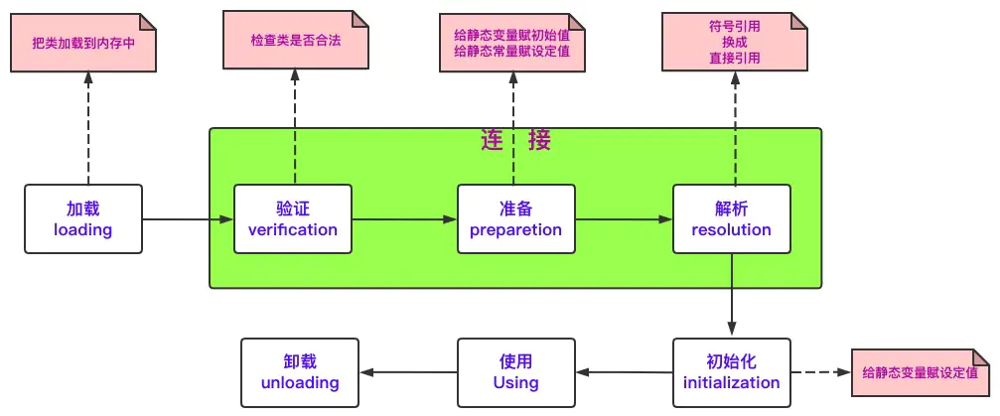
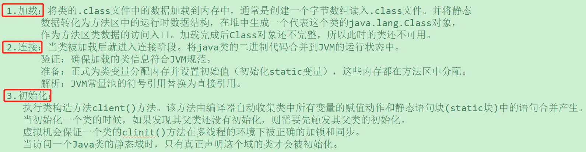

# 类加载器

## 概述

1. 根加载器bootstrap classloader: 负责加载java的核心类（jre下lib和class目录的内容）
   1. 根加载器使用 C/C++ 编写，无法在 Java 中获得其实例。
   2. 根加载器默认加载系统变量 sun.boot.class.path 指定的类库。
   3. 可以使用 -Xbootclasspath/a 参数追加根加载器的默认加载类库
2. 扩展类加载器extension classloader: 负责加载java的扩展类（jre下的lib/ext目录的内容）
   1. 扩展类加载器是使用 Java 实现的类加载器，可以在程序中获得它的实例并使用。
   2. 通常不建议修改java.ext.dirs参数的值来修改默认加载目录，如有需要，可以将要加载的类库放到这个默认目录下
3. 应用类加载器AppClassLoader system classloader: 负责加载应用指定的类（环境变量classpath中配置的内容）
   1. 应用类加载器是使用 Java 实现的类加载器，负责加载应用程序 classpath 下的类库。
   2. 应用类加载器是最常用的类加载器
4. 自定义类加载器，继承自java.lang.ClassLoader
   1. 如果在创建自定义类加载器时没有指定父加载器，那么默认使用 AppClassLoader作为父加载器

## PDM

类加载过程采取了双亲委派模型(Parents Delegation Model【PDM】)，PDM 更好的保证了 Java 平台的安全性。在该机制中，JVM 自带的 BootStrapClassLoader 是根加载器，其他的加载器都有且仅有一个父类加载器。类的加载首先请求父类加载器加载，父类加载器无能为力时才由其子类加载器自行加载。JVM 不会向 Java 程序提供对 BootStrapClassLoader 的引用.  
PDM 只是 Java 推荐的机制，并不是强制的。可以继承java.lang.ClassLoader类，实现自己的类加载器。如果想保持 PDM，就重写 findClass(name)；如果想破坏 PDM，就重写 loadClass(name).

为什么需要PDM:
1.  防止内存中出现多份同样的字节码
2.  安全性，防止自定义的java.lang.String
3.  同一份字节码，不同的类加载器，则不属于同一类型

## 类加载过程

  
  

Java的类加载是指类从被加载到虚拟机内存中开始，到卸载出虚拟机内存为止的整个生命周期中的整个过程，包括加载、验证、准备、解析和初始化五个阶段。加载指的是类加载的第一个阶段。加载阶段，虚拟机需要完成以下3件事情：
1. 通过一个类的全限定名来获取定义此类的二进制字节流。
2. 将这个字节流所代表的静态存储结构转化为方法区的运行时数据结构。
3. 在内存中生成一个代表这个类的java.lang.Class对象，作为方法区这个类的各种数据结构的访问入口

类中的静态块会在整个类加载过程中的初始化阶段执行，而不是在类加载过程中的加载阶段执行。初始化阶段是类加载过程中的最后一个阶段，该阶段就是执行类构造器<clinit>方法的过程，<clinit>方法由编译器自动收集类中所有类变量(静态变量)的赋值动作和静态语句块中的语句合并生成，一个类一旦进入初始化阶段，必然会执行静态语句块。所以说，静态块一定会在类加载过程中被执行，但不会在加载阶段被执行。

## 类的初始化条件

Java 虚拟机规范中严格规定了有且只有五种情况必须对类进行初始化：
1. 使用 new 字节码指令创建类的实例，或者使用 getstatic、putstatic 读取或设置一个静态字段的值(放入常量池中的常量除外)，或者调用一个静态方法的时候，对应类必须进行过初始化
2. 通过java.lang.reflect包的方法对类进行反射调用的时候，如果类没有进行过初始化，则要首先进行初始化
3. 当初始化一个类的时候，如果发现其父类没有进行过初始化，则首先触发父类初始化
4. 当虚拟机启动时，用户需要指定一个主类(包含main()的类)，虚拟机会首先初始化这个类
5. 使用 jdk1.7 的动态语言支持时，如果一个java.lang.invoke.MethodHandle实例最后的解析结果 REF_getStatic、REF_putStatic、RE_invokeStatic 的方法句柄，并且这个方法句柄对应的类没有进行初始化，则需要先触发其初始化

以下几种不会触发类的初始化
1. 通过子类调用父类的静态字段。此时父类符合情况一，而子类不符合任何情况。所以只有父类被初始化。
2. 通过数组来引用类，不会触发类的初始化。因为 new 的是数组，而不是类。
3. 调用类的静态常量不会触发类的初始化，因为静态常量在编译阶段就会被存入调用类的常量池中，不会引用到定义常量的类

## getResourceAsStream

1. class的getResourceAsStream
   1. class.getResourceAsStream(“path”): path不以’/‘开头时，默认是指所在类的相对路径，从这个相对路径下取资源
   2. class.getResourceAsStream("/path"): path以’/'开头时，则是从项目的ClassPath根下获取资源，就是要写相对于classpath类路径下的绝对路径
2. classloader的getResourceAsStream
   1. path不能以`/`开头，path是指类加载器的加载范围，在资源加载的过程中，使用的逐级向上委托的形式加载的，`/`表示Boot ClassLoader，类加载器中的加载范围，因为这个类加载器是C++实现的，所以加载范围为null
3. class.getResourceAsStream最终调用是ClassLoader.getResourceAsStream，这两个方法最终调用还是ClassLoader.getResource()方法加载资源