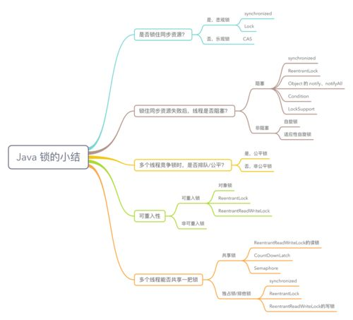

# 并发

- [并发](#并发)
  - [悲观锁(Pessimistic Lock)](#悲观锁pessimistic-lock)
    - [共享锁](#共享锁)
    - [排他锁](#排他锁)
  - [乐观锁](#乐观锁)
    - [CAS](#cas)
    - [版本号控制](#版本号控制)
    - [分段降低锁粒度](#分段降低锁粒度)
  - [Synchronized](#synchronized)
  - [选择](#选择)
  - [锁总结](#锁总结)
  - [高并发](#高并发)
  - [wait,notify,notifyAll](#waitnotifynotifyall)


## 悲观锁(Pessimistic Lock)

当要对数据库中的一条数据进行修改的时候，为了避免同时被其他人修改，最好的办法就是直接对该数据进行加锁以防止并发。这种借助数据库锁机制，在修改数据之前先锁定，再修改的方式被称之为悲观并发控制【Pessimistic Concurrency Control，缩写“PCC”，又名“悲观锁”】。    
先加锁，后操作。  
传统的关系型数据库使用这种锁机制，比如行锁，表锁等，读锁，写锁,Java里面的同步synchronized 关键字的实现都是悲观锁。

### 共享锁

共享锁【shared locks】又称为读锁，简称S锁。顾名思义，共享锁就是多个事务对于同一数据可以共享一把锁，都能访问到数据，但是只能读不能修改

### 排他锁

排他锁【exclusive locks】又称为写锁，简称X锁。顾名思义，排他锁就是不能与其他锁并存，如果一个事务获取了一个数据行的排他锁，其他事务就不能再获取该行的其他锁，包括共享锁和排他锁，但是获取排他锁的事务是可以对数据行读取和修改

## 乐观锁

乐观锁是相对悲观锁而言的，乐观锁假设数据一般情况下不会造成冲突，所以在数据进行提交更新的时候，才会正式对数据的冲突与否进行检测，如果发现冲突了，则返回给用户错误的信息，让用户决定如何去做。乐观锁适用于读操作多的场景，这样可以提高程序的吞吐量。

### CAS
Compare and Swap  
Java 中java.util.concurrent.atomic包下面的原子变量使用了乐观锁的一种 CAS 实现方式。

### 版本号控制

一般是在数据表中加上一个数据版本号 version 字段，表示数据被修改的次数。当数据被修改时，version 值会+1。当线程A要更新数据值时，在读取数据的同时也会读取 version 值，在提交更新时，若刚才读取到的 version 值与当前数据库中的 version 值相等时才更新，否则重试更新操作，直到更新成功

### 分段降低锁粒度

1. ConcurrentHashMap
   1. 两层hash，先获取Segment, 再获取元素
   2. 对每个Segment加各自的锁
   3. 统计时，先用乐观锁尝试一定次数，再转为悲观锁;1.8使用baseCount
   4. 段内扩容
   5. 1.8移除 Segment，使锁的粒度更小，Synchronized + CAS + Node + Unsafe

LongAddr,

## Synchronized

1. 无锁->偏向锁->轻量级锁->重量级锁
2. 锁消除
   1. 锁消除是虚拟机另外一种锁的优化，这种优化更彻底，Java 虚拟机在 JIT 编译时(可以简单理解为当某段代码即将第一次被执行时进行编译，又称即时编译)，通过对运行上下文的扫描，去除不可能存在共享资源竞争的锁，通过这种方式消除没有必要的锁，可以节省毫无意义的请求锁时间。
3. 锁粗化
   1. 如果虚拟机检测到有这样一串零碎的操作都对同一个对象加锁，将会把加锁同步的范围扩展(粗化)到整个操作序列的外部

## 选择

1. 响应效率：如果需要非常高的响应速度，建议采用乐观锁方案，成功就执行，不成功就失败，不需要等待其他并发去释放锁。乐观锁并未真正加锁，效率高。一旦锁的粒度掌握不好，更新失败的概率就会比较高，容易发生业务失败。
2. 冲突频率：如果冲突频率非常高，建议采用悲观锁，保证成功率。冲突频率大，选择乐观锁会需要多次重试才能成功，代价比较大。
3. 重试代价：如果重试代价大，建议采用悲观锁。悲观锁依赖数据库锁，效率低。更新失败的概率比较低。
4. 乐观锁如果有人在你之前更新了，你的更新应当是被拒绝的，可以让用户从新操作。悲观锁则会等待前一个更新完成。这也是区别
## 锁总结



## 高并发

1. 系统集群化
2. 数据库层面的分库分表+读写分离
3. 针对读多写少的请求，引入缓存集群
4. 针对高写入的压力，引入消息中间件集群

## wait,notify,notifyAll

1. wait	线程自动释放占有的对象锁，并等待notify。
2. notify	随机唤醒一个正在wait当前对象的线程，并让被唤醒的线程拿到对象锁
3. notifyAll	唤醒所有正在wait当前对象的线程，但是被唤醒的线程会再次去竞争对象锁。因为一次只有一个线程能拿到锁，所有其他没有拿到锁的线程会被阻塞。推荐使用。

```java
/**
 * 生产者
 */
class Producter extends Thread {
    @Override
    public void run() {
        while (run) {
            synchronized (queue) {
                while (queue.size() >= MAX_CAPACITY * 2) {
                    try {
                        System.out.println("缓冲队列已满，等待消费");
                        queue.wait();
                    } catch (InterruptedException e) {
                        e.printStackTrace();
                    }
                }
                try {
                    String string = UUID.randomUUID().toString();
                    queue.put(string);
                    System.out.println("生产:" + string);
                    Thread.sleep(500);
                } catch (InterruptedException e) {
                    e.printStackTrace();
                }
                queue.notifyAll();//通知生产者和消费者
            }
        }
    }
}
```