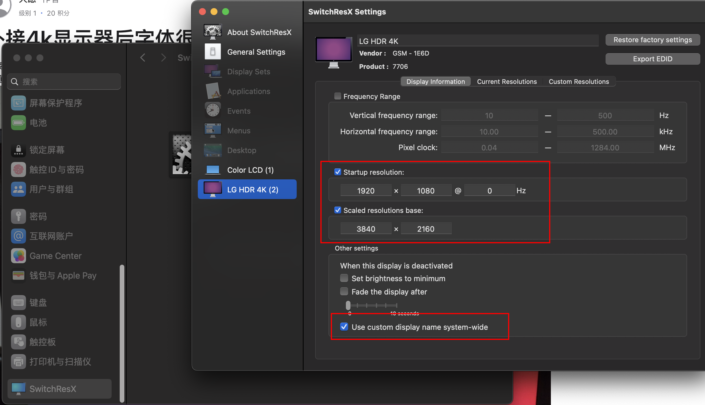
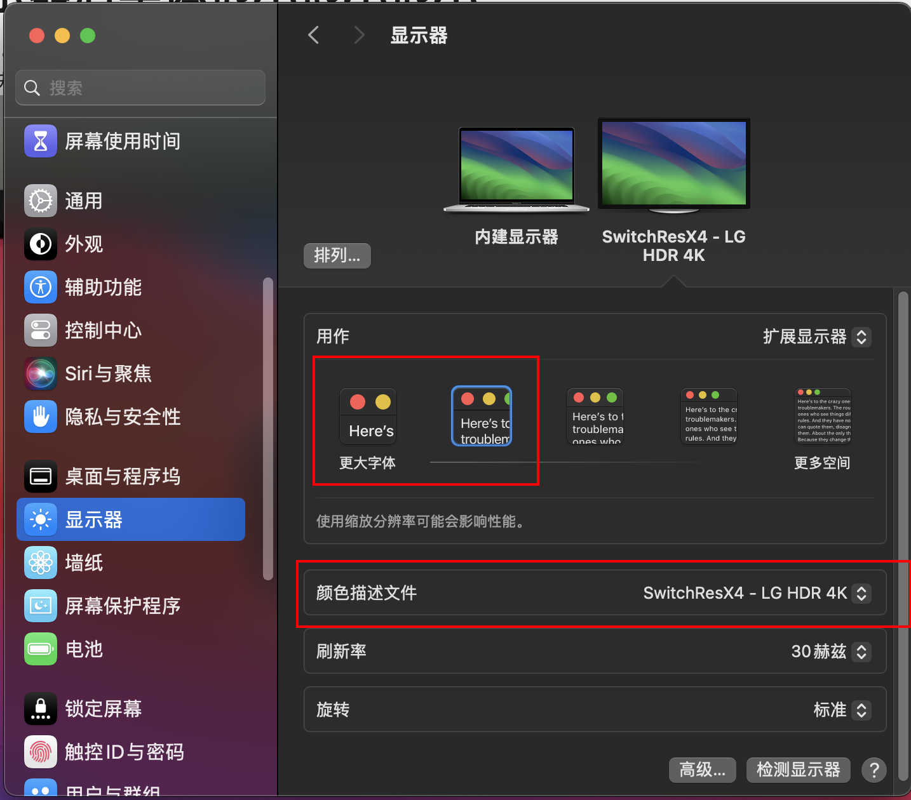

# Mac

- [Mac](#mac)
  - [允许安装任何来源](#允许安装任何来源)
  - [键盘映射](#键盘映射)
  - [快捷键](#快捷键)
  - [包管理器Homebrew](#包管理器homebrew)
    - [7z](#7z)
  - [命令](#命令)
    - [ping端口](#ping端口)
  - [问题](#问题)
    - [Clean Mac X运行错误](#clean-mac-x运行错误)
  - [证书问题](#证书问题)
    - [生成证书和私钥](#生成证书和私钥)
    - [浏览器信任](#浏览器信任)
  - [虚拟机](#虚拟机)
    - [Vmware Fusion](#vmware-fusion)
      - [mac主机获取虚拟机ip](#mac主机获取虚拟机ip)
  - [v2ray](#v2ray)
  - [外接显示器](#外接显示器)
    - [显示器分辨率不全](#显示器分辨率不全)
    - [外接显示器显示字体太小](#外接显示器显示字体太小)

## 允许安装任何来源

1. 命令行输入`sudo spctl --master-disable`

## 键盘映射

1. Home键=Fn+左方向
2. End键=Fn+右方向
3. PageUP=Fn+上方向、
4. PageDOWN=Fn+下方向、
5. 向前Delete=Fn+delete键
6. Fn + Control + ← 上一个标签页
7. Fn + F2 聚焦到菜单栏
8. Ctrl + → 右边的桌面

## 快捷键

1. 应用最小化: Command + M
2. 从最下画恢复: Command + tab切换到，松开tab，按住option,松开command
3. 固定大写: control + caps
4. 强制关闭程序: command+option+esc
5. 清空回收站: command+shift+delete
6. 移到回收站: command+delete
7. 非全屏隐藏: command + h
8. 进入文件夹: Command + ↓ 
9. 返回上一层: Command + ↑ 
10. 桌面视图: Ctrl + ↑

## 包管理器Homebrew

[官网](https://brew.sh/index.html)

1. 安装Homebrew: `/bin/bash -c "$(curl -fsSL https://raw.githubusercontent.com/Homebrew/install/master/install.sh)"`
2. 安装其他工具`brew install wget`
3. 卸载其他工具`brew uninstall wget`
4. 列出已安装的软件`brew list`
5. brew update 更新
6. brew brew home 用浏览器打开brew的官方网站
7. brew info 显示软件信息
8. brew deps 显示包依赖

### 7z

1. 安装： `brew install pzip`
2. 压缩 sputnik 文件夹下的所有文件`7z a heed.7z sputnik`
3. 解压 heed.7z`7z x heed.7z`

## 命令

### ping端口

1. `nc -vz -w 2 127.0.0.1 1080`

## 问题

### [Clean Mac X运行错误](https://www.macbed.com/if-crashes-when-opening/)

Apple removed TNT’s certificate, so the app will crash after July 12th. The current solution is to sign it yourself.

Run in Terminal

> codesign --force --deep --sign - /Applications/name.app  

Requisite: Xcode or the Apple Command Line Tools
To install, execute

> xcode-select --install  

## 证书问题

### 生成证书和私钥

> openssl req -newkey rsa:2048 -nodes -keyout rsa_private.key -x509 -days 365 -out cert.crt

### 浏览器信任

1. 打开［应用程序］>［实用工具］>［钥匙串访问］，并在左侧导航选择［系统］
   1. Chrome在[设置]->[隐私设置和安全性]->[安全]->[管理证书]打开钥匙串
2. 选择顶部的［文件］［导入项目］，并定位到goagent安装目录的Application/goagent/local/CA.crt。选择导入
3. 右键选择新导入的GoAgent CA证书，选择［显示简介］，然后选择展开［信任］一栏，确保所有的选择都是［总是信任］
4. 重启浏览器

## 虚拟机

### Vmware Fusion

#### mac主机获取虚拟机ip

1. 将虚拟机的网络适配器改为Nat模式（与mac共享）
2. 进入虚拟机执行相关命令获取虚拟机的ip

## v2ray

[V2rayU](https://github.com/yanue/V2rayU)

[全部客户端推荐](https://ssrvps.org/v2ray%E5%AE%A2%E6%88%B7%E7%AB%AF)

## 外接显示器

### 显示器分辨率不全

1. 换下typec接口，部分typec接口不支持4K等高分辨率
2. 换下数据线，部分数据线不支持4K60hz传输

### 外接显示器显示字体太小

macbook外接4K显示器时，如果设置为4K分辨率，字体太小，如果设置为1080p分辨率，字体又太模糊，可以使用SwitchResX进行调整, 可以参考[外接4K显示器后字体很小](https://discussionschinese.apple.com/thread/252561125?sortBy=best) . 

1. 从[官网](https://www.madrau.com/data/switchresx/SwitchResX4.zip)下载后安装
2. 打开SwitchResX的设置，选择自己的外接显示器，如图设置后关闭(保存)设置界面
3. 重新插拔数据线
4. 打开显示器设置, 选择比较小的分辨率即可